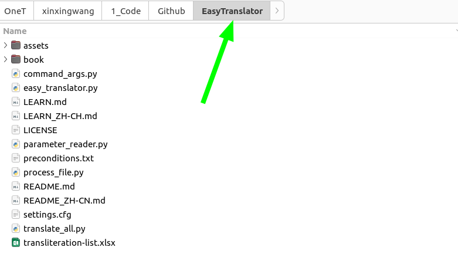
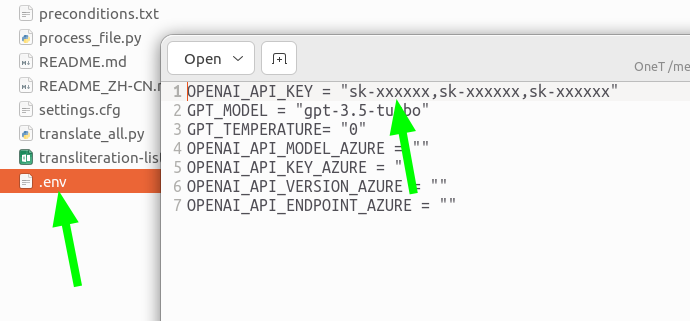
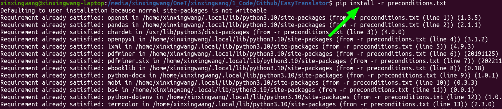
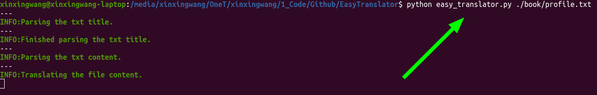

<p align="center">
  
  <h1 align="center">&nbsp;&nbsp;&nbsp;&nbsp;Easy Translator</h1>
  <p align="center">&nbsp;&nbsp;&nbsp;Your Companion for Multilingual Reading</p>
</p>

<div align="center">

[](./README.md)[](./README_ZH-CN.md)[](https://twitter.com/EthanWang999)[](https://www.youtube.com/@EthanWang999)[](https://space.bilibili.com/29185421)

<a href="https://www.buymeacoffee.com/ethanwang" target="_blank"></a>
</div>

---

## :bookmark_tabs: Introduction

A command-line tool crafted with the OpenAI API, supporting translation for various file formats, including .txt, .pdf, .docx, .md, .mobi, and .epub.  
Effortlessly translate your text files, eliminating language barriers with ease.

## :bell: Prerequisites

###### :snake: Code Section

```bash
git clone https://github.com/artwalker/EasyTranslator.git
```

```bash
pip install -r preconditions.txt
```

###### :scroll: Configuration Files

- .env
  - Follow the instructions [here](https://platform.openai.com/api-keys) to get your OpenAI API key

  - `OPENAI_API_KEY`: Specify the OpenAI API Key, can use multiple keys, format like "sk-xxxxxxx, sk-xxxxxxx"

  - `GPT_MODEL`: Specify the model to be used, for example, "gpt-3.5-turbo"

  - `GPT_TEMPERATURE`: Specify the randomness of the model's responses, it's advisable to set it to 0 for text translation.

  - If using OpenAI API provided by Azure, the following parameters need to be set:

  - `OPENAI_API_MODEL_AZURE`: Deployment name on Azure

  - `OPENAI_API_KEY_AZURE`: Specify the key for Azure OpenAI API

  - `OPENAI_API_ENDPOINT_AZURE`: Endpoint of the API

  - `OPENAI_API_VERSION_AZURE`: Version of the API

- settings.cfg:
  - `openai-proxy`: Proxy for OpenAI

  - `language`: Language for translation

  - `prompt`: Input prompt for specified model translation

  - `bilingual-output`: Whether to save as bilingual text

  - `langcode`: Language code for generated epub files

  - `startpage`: Starting page for specified pdf file

  - `endpage`: Ending page for specified pdf file

  - `transliteration-list`: Transliteration list file name

  - `transliteration-word-capi-low`: Whether the transliteration list is case-sensitive

## :running: Usage

```bash
python easy_translator.py filename [--show] [--tlist] [--azure] [--test]
```

```bash
python translate_all.py
```
> Please add a period at the position in the .md document where there is no ending punctuation mark

###### :clap: Explanation

- `filename`: Specify the name of the file to be translated, supports txt, pdf, docx, epub, mobi formats

- `--show`: Display the translation process of the text

- `--tlist`: Use a transliteration list

- `--azure`: Use Azure to call the OpenAI API

- `--test`: Used to test the translation effect, translates three paragraphs of text, typically used for debugging

- `translate_all.py`: Use the script translate_all.py to batch translate text
  - First, make sure that the file names are in the format of **01_filea.txt, 02_fileb.txt,** etc., with a sorting prefix added before each file name

  - Second, place the text you want to translate in the **book** directory. You can modify this directory in the source code if needed

###### :pushpin: Example

```bash
python easy_translator.py ./book/profile.txt
```

```bash
python easy_translator.py ./book/profile.txt --show
```

```bash
python easy_translator.py ./book/profile.txt --azure
```

```bash
python easy_translator.py ./book/profile.txt --azure --show
```

```bash
python easy_translator.py ./book/profile.txt --show --tlist
```

```bash
python easy_translator.py ./book/profile.txt --show --tlist --azure
```

```bash
python easy_translator.py ./book/profile.txt --show --tlist --azure --test
```

<div align="center">


<br>
<em>Choose a directory and clone the project using the terminal</em>

</div>

<div align="center">


<br>
<em>Enter the directory of the cloned project</em>

</div>

<div align="center">


<br>
<em>Configure OpenAI's key</em>

</div>

<div align="center">


<br>
<em>Open the terminal in the current directory</em>

</div>

<div align="center">



<br>
<em>Run the pip command</em>

</div>

<div align="center">



<br>
<em>Start the translation journey happily</em>

</div>

## :gift_heart: Reward

<p align="left">
If you feel that this program has awakened your soul like a cup of hot coffee or solved your problems like a Swiss army knife, you might consider showing your appreciation with a reward;</p>  
<p align="left"> Just like tipping a barista, your contribution will fuel my motivation to improve this program and create new code, making the world a better place;</p>  
<p align="left">Regardless of the amount you choose to reward, I will be delighted, as if receiving a gift;</p>  
<p align="left">Thank you for your generous support!</p>  

<div align="center">

|  |  |
|:---:|:---:
| Alipay | WeChat  |

</div>

---

<div align="center">

[](https://star-history.com/#artwalker/EasyTranslator.git&Timeline)

</div>
