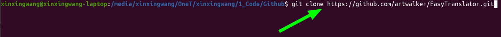

<p align="center">
  
  <h1 align="center">&nbsp;&nbsp;&nbsp;&nbsp;简译</h1>
  <p align="center">&nbsp;&nbsp;&nbsp;多语言阅读得力助手</p>
</p>

<div align="center">

[](./README.md)[](./README_ZH-CN.md)[](https://twitter.com/EthanWang999)[](https://www.youtube.com/@EthanWang999)[](https://space.bilibili.com/29185421)

<a href="https://www.buymeacoffee.com/ethanwang" target="_blank"></a>
</div>

---

## :bookmark_tabs: 介绍

利用 OpenAI API 打造的命令行工具，支持多种格式文件的翻译，包括 .txt、.pdf、.docx、.md、.mobi 和 .epub。  
轻松快捷地翻译您的文本文件，让语言不再成为阻碍。

## :bell: 前置条件

###### :snake: 代码部分

```bash
git clone https://github.com/artwalker/EasyTranslator.git
```

```bash
pip install -r preconditions.txt
```

###### :scroll: 配置文件

- .env
  - 按照[这里](https://platform.openai.com/api-keys)的说明获取您的OpenAI API密钥

  - `OPENAI_API_KEY`: 指定 OpenAI API Key，可以使用多个，格式如 "sk-xxxxxxx, sk-xxxxxxx"

  - `GPT_MODEL`: `GPT_MODEL`: 指定所使用的模型，例如 "gpt-3.5-turbo"

  - `GPT_TEMPERATURE`: 指定模型回复的随机度，因为是翻译文本，所以最好设置为0

  - 若使用 **Azure** 提供的 OpenAI API，需要设置以下参数：

  - `OPENAI_API_MODEL_AZURE`: 部署在 Azure 上的引擎名称

  - `OPENAI_API_KEY_AZURE`: 指定 Azure OpenAI API 的密钥

  - `OPENAI_API_ENDPOINT_AZURE`: Azure 的端点

  - `OPENAI_API_VERSION_AZURE`: API 的版本

- settings.cfg:
  - `openai-proxy`: OpenAI 的代理

  - `language`: 要翻译的语言

  - `prompt`: 输入指定模型翻译的 prompt

  - `bilingual-output`: 是否保存为双语文本

  - `langcode`: 生成的 epub 文件语言编码

  - `startpage`: 指定 pdf 文件的起始页码

  - `endpage`: 指定 pdf 文件的结束页码

  - `transliteration-list`: 译名表文件名称

  - `transliteration-word-capi-low`: 译名表是否匹配大小写

## :running: 使用方法

```bash
python easy_translator.py filename [--show] [--tlist] [--azure] [--test]
```

```bash
python translate_all.py
```

> 请在.md文档中没有结束标点符号的位置添加英文格式的句号.

###### :clap: 说明

- `filename`: 指定要翻译的文件名，支持 txt、pdf、docx、epub、mobi 格式

- `--show`: 显示文本翻译过程

- `--tlist`: 使用译名表

- `--azure`: 使用 Azure 调用 OpenAI API

- `--test`: 用于测试翻译效果，翻译三段文字，通常用于调试程序

- `translate_all.py`：使用脚本 translate_all.py 批量翻译文本
  - 首先，请确保文件名的格式为 **01_filea.txt, 02_fileb.txt** 等，在每个文件名前添加排序前缀

  - 其次，请将您想要翻译的文本放置在 **book** 目录中，如果需要，可以在源代码中修改此目录

###### :pushpin: 举例

```bash
python easy_translator.py ./book/profile.txt
```

```bash
python easy_translator.py ./book/profile.txt --azure
```

```bash
python easy_translator.py ./book/profile.pdf --show
```

```bash
python easy_translator.py ./book/profile.pdf --azure --show
```

```bash
python easy_translator.py ./book/profile.mobi --show --tlist
```

```bash
python easy_translator.py ./book/profile.mobi --show --tlist --azure
```

```bash
python easy_translator.py ./book/profile.epub --show --tlist --test
```

```bash
python easy_translator.py ./book/profile.epub --show --tlist --azure --test
```

<div align="center">


<br>
<em>选择一个目录并使用终端克隆项目</em>

</div>

<div align="center">


<br>
<em>配置OpenAI的Key</em>

</div>

<div align="center">


<br>
<em>进入克隆的项目的目录下/em>

</div>

<div align="center">


<br>
<em>在当前目录下打开终端</em>

</div>

<div align="center">


<br>
<em>运行pip指令</em>

</div>

<div align="center">


<br>
<em>开始愉快地翻译旅程吧</em>

</div>

## :gift_heart: 打赏
<p align="center">如果你觉得这个程序像一杯热咖啡一样唤醒了你的灵魂，或者像一把瑞士军刀一样解决了你的问题，那么你可能想要考虑打赏一下；</p>  
<p align="center">就像给咖啡师小费一样，你的打赏将为我注入更多的动力去改进这个程序及创造新的代码，让世界成为一个更好地方；</p>  
<p align="center">无论你选择打赏多少，我都会像收到礼物一样感到欣喜；</p>  
<p align="center">感谢你的慷慨支持！</p>  

<div align="center">

|  |  |
|:---:|:---:
| 支付宝 | 微信 |

</div>

---

<div align="center">

## Star History

[](https://star-history.com/#artwalker/EasyTranslator.git&Timeline)

</div>
